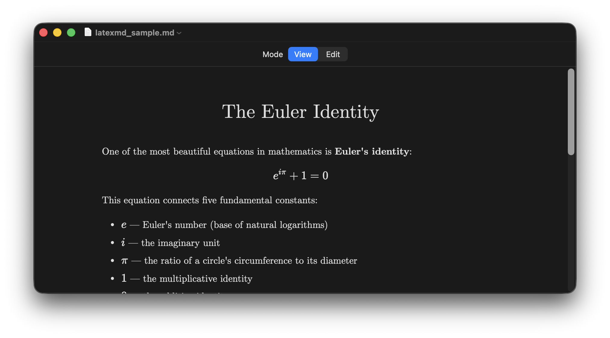
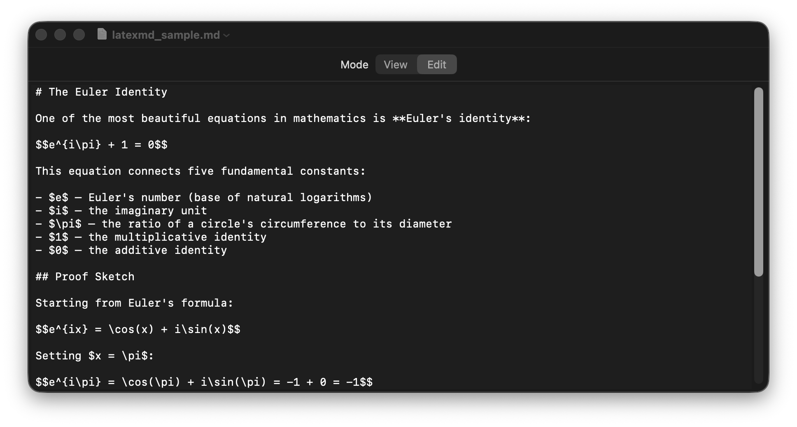

# LaTeXMD

A lightweight, native macOS app that renders Markdown files with beautiful LaTeX-style typography and math equations.

Built with [Claude Opus 4.6](https://claude.ai).

| View Mode | Edit Mode |
|:-:|:-:|
|  |  |

## Features

- **LaTeX Math Rendering** — Full math support via KaTeX (`$...$` inline, `$$...$$` display)
- **LaTeX Typography** — Computer Modern fonts, justified text, proper spacing
- **View / Edit Toggle** — Switch between rendered view and plain text editor
- **Native macOS App** — File > Open, Save, Recent Documents, double-click .md files
- **Dark Mode** — Automatic dark mode support
- **Zero Dependencies** — Pure Swift + system frameworks (KaTeX loaded from CDN)
- **Open Source** — MIT License

## Install

### Download (Recommended)

1. Download [`LaTeXMD.dmg`](https://github.com/FlaccidNoise/LaTeXMD/releases/latest/download/LaTeXMD.dmg)
2. Open the DMG
3. Drag LaTeXMD to Applications
4. Launch and optionally set as default .md handler

### Build from Source

Requires Xcode Command Line Tools (`xcode-select --install`).

```bash
git clone https://github.com/yourusername/LaTeXMD.git
cd LaTeXMD
make          # build + bundle + sign
make run      # build and open
make install  # copy to /Applications
make dmg      # create distributable DMG
```

## Usage

- **Open a file**: File > Open (Cmd+O) or double-click any `.md` file
- **Switch modes**: Click "View" or "Edit" in the segmented control
- **Save**: Cmd+S
- **New document**: File > New (Cmd+N)

## Build Targets

| Command | Description |
|---------|-------------|
| `make` | Build, bundle, and ad-hoc sign |
| `make run` | Build and launch |
| `make install` | Copy to /Applications |
| `make dmg` | Create DMG installer |
| `make icon` | Regenerate app icon |
| `make clean` | Remove build artifacts |

## Requirements

- macOS 13 (Ventura) or later
- Xcode Command Line Tools

## License

MIT — see [LICENSE](LICENSE).
